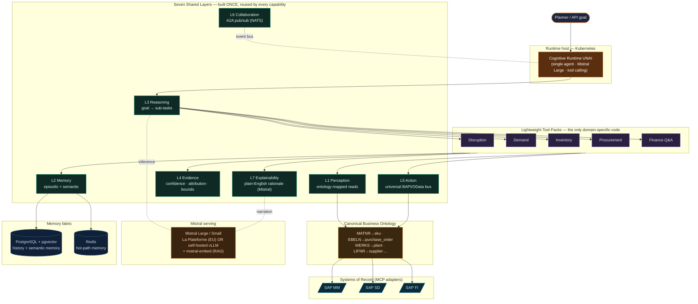
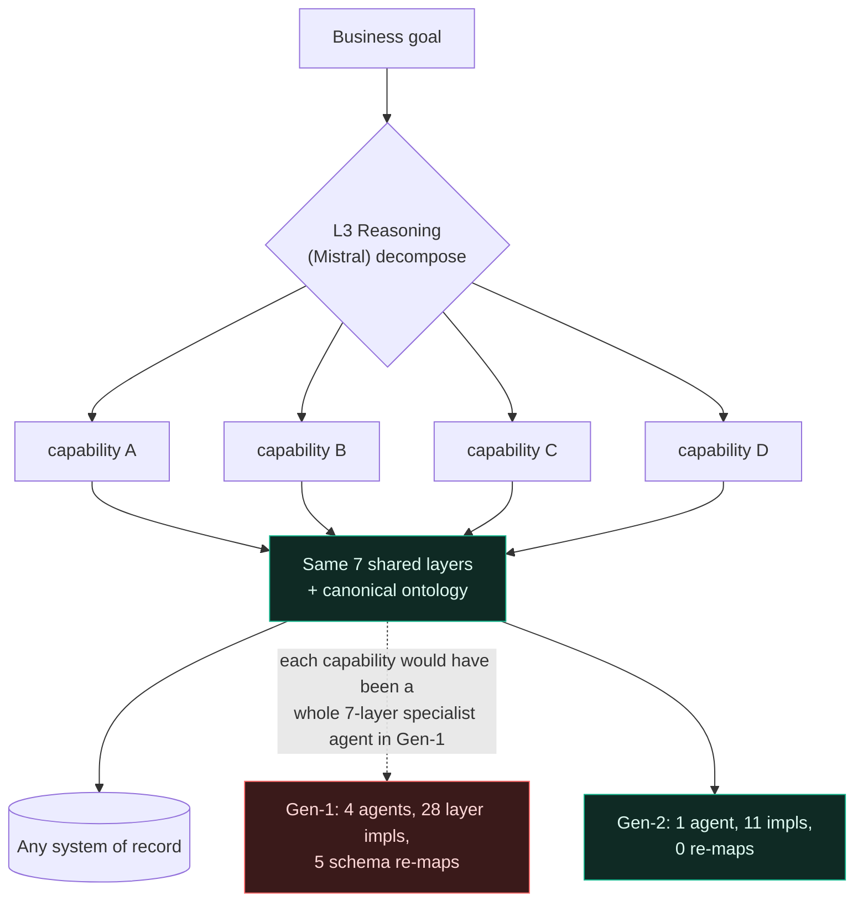

# UNAI — Architecture Flows (Mermaid)

Mistral-centric, cloud-neutral stack. These diagrams render anywhere Mermaid is
supported (GitHub, VS Code, https://mermaid.live, Notion, etc.).

---

## Flow 1 — The Generation-2 UNAI Platform (7 shared layers)



---

## Flow 2 — Gen-1 (many specialist agents) vs Gen-2 (one UNAI)

```mermaid
flowchart LR
    subgraph GEN1["GEN 1 — 10 specialist agents × 7 layers = 70 implementations"]
      direction TB
      A1["Demand Agent<br/>7 layers"]:::g1
      A2["Inventory Agent<br/>7 layers"]:::g1
      A3["Procurement Agent<br/>7 layers"]:::g1
      A4["Disruption Agent<br/>7 layers"]:::g1
      A5["... 6 more agents<br/>each 7 layers"]:::g1
      A1 <--> A2 <--> A3 <--> A4 <--> A5
      A1 <--> A3
      A2 <--> A4
      note1["N×(N-1)/2 = 45 point-to-point links<br/>878 maintenance hrs/mo"]:::bad
    end

    subgraph GEN2["GEN 2 — 1 UNAI: 7 shared layers + 10 tool packs"]
      direction TB
      SUP["Universal UNAI<br/>7 shared layers · Mistral"]:::g2
      TP["10 lightweight tool packs"]:::pack
      BUS{{A2A pub/sub bus (NATS)<br/>linear scaling}}:::bus
      SUP --- TP
      SUP --- BUS
      note2["17 implementations · 80 maintenance hrs/mo<br/>new capability = config, not a project"]:::good
    end

    GEN1 -- "90% complexity removed" --> GEN2

    classDef g1 fill:#3a1a1a,stroke:#ff6b6b,color:#ffd9d9;
    classDef g2 fill:#0f2a24,stroke:#13b58c,color:#dffaf2;
    classDef pack fill:#2a2140,stroke:#9b6bff,color:#eadcff;
    classDef bus fill:#5a2f10,stroke:#e07b2a,color:#ffe7d2;
    classDef bad fill:#2a0f0f,stroke:#ff6b6b,color:#ffb3b3;
    classDef good fill:#0c2417,stroke:#13b58c,color:#9ff0c8;
```

---

## Flow 3 — Disruption-response execution & context switching across systems

```mermaid
sequenceDiagram
    autonumber
    actor P as Planner / Trigger
    participant O as Cognitive Runtime UNAI (Mistral Large)
    participant ON as Canonical Ontology
    participant PG as Postgres/pgvector
    participant SD as SAP SD
    participant MM as SAP MM
    participant FI as SAP FI

    P->>O: Goal: "Respond to APAC supplier disruption"
    Note over O: L3 Reasoning (Mistral) decomposes into 4 capabilities

    rect rgb(20,40,30)
    Note right of O: Capability 1 — Disruption detect
    O->>PG: read supplier-risk signals
    PG-->>ON: native fields (vendor_id, risk)
    ON-->>O: canonical (supplier=V-2207, risk=0.78)
    end

    rect rgb(35,25,15)
    Note right of O: Capability 2 — Demand re-forecast (context switch → SD)
    O->>SD: read open demand (KWMENG)
    SD-->>ON: native field KWMENG
    ON-->>O: canonical open_demand — 0 re-map cost
    end

    rect rgb(20,30,50)
    Note right of O: Capability 3 — Inventory adjust (switch → MM)
    O->>MM: read stock (LABST, EISBE)
    O->>MM: write SAFETY_STOCK_UPDATE (L5 Action)
    end

    rect rgb(45,30,15)
    Note right of O: Capability 4 — Procurement (switch MM↔FI)
    O->>FI: read spend context (DMBTR)
    O->>O: L4 Evidence — confidence 88% + $ governance gate
    O-->>P: PO > $50K → routed to a human approver
    end

    O-->>P: L7 Explainability (Mistral) — rationale + audit trail
    Note over O,FI: 5 system transitions · 0 schema re-maps (ontology absorbs them)
```



---

## Flow 4 — The substitution principle (one diagram, the whole thesis)


