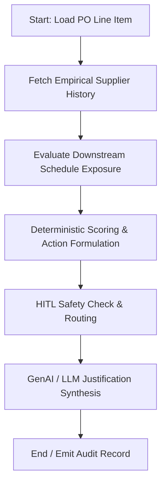

# Agent 1: PO Promise Drift Agent

## 1. Executive Summary & Problem Statement
In industrial SAP supply chain environments, purchase orders (POs) are placed with an initial delivery date (`EKET-EINDT`). Suppliers routinely update or slip their delivery promise dates without formal change requests. When buyers fail to proactively catch this "drift," manufacturing lines experience stockouts, production orders are stalled, and customer deliveries miss SLAs.

**Agent 1: PO Promise Drift Agent** continuously audits open PO line items, models empirical supplier delivery performance from historical goods receipts (`MSEG`/`EKBE`), assesses downstream production schedule exposure (`AFKO`/`MD04`), and proposes automated rescheduling or supplier expediting under strict Human-In-The-Loop (HITL) control.

---

## 2. Architecture & State Machine

The agent is built using **LangGraph** (`StateGraph`) with strict separation between deterministic mathematics and natural language explanation.



### State Definitions
- `po_item`: Target Purchase Order number and Item line.
- `supplier_metrics`: Historical delivery drift, late rate, 90th percentile delay.
- `downstream_exposure`: Inventory cover days, impacted production orders, at-risk revenue.
- `evaluation`: Deterministic risk category (`LOW`, `MEDIUM`, `HIGH`, `SEVERE`) and recommended action (`MONITOR`, `SUPPLIER_FOLLOW_UP`, `EXPEDITE_AND_RESCHEDULE_LINE`).
- `hitl_ticket`: Pending approval ticket for buyer review.

---

## 3. Mathematical & Policy Foundation

### 3.1 Empirical Supplier Drift Metric
For historical deliveries $i \in \{1, \dots, N\}$:
$$\text{Drift}_i = \text{Actual GR Date}_i - \text{Promised Delivery Date}_i$$
$$\text{Late Delivery Rate} = \frac{\sum_{i=1}^{N} \mathbb{I}(\text{Drift}_i > 0)}{N}$$
$$\text{Severe Drift Rate} = \frac{\sum_{i=1}^{N} \mathbb{I}(\text{Drift}_i > 3)}{N}$$

### 3.2 Downstream Exposure Metric
$$\text{Days of Cover} = \frac{\text{Current Unrestricted Stock}}{\text{Average Daily Consumption}}$$
$$\text{Line Starvation Risk} = \max(0, \text{Promised Date} + \text{Drift} - \text{Next Scheduled Prod Order Start})$$

### 3.3 Composite Risk Score
$$\text{Risk Score} = 0.40 \cdot \text{Late Rate} + 0.35 \cdot \text{Severe Drift Rate} + 0.25 \cdot \left(1 - \min(1, \frac{\text{Days of Cover}}{10})\right)$$

| Score Range | Classification | Default Action | Action Mode |
| :--- | :--- | :--- | :--- |
| **0 - 30** | `LOW` | `MONITOR` | Autonomous (Logged) |
| **31 - 60** | `MEDIUM` / `HIGH` | `SUPPLIER_FOLLOW_UP` | Buyer Queue (HITL) |
| **> 60** | `SEVERE` | `EXPEDITE_AND_RESCHEDULE_LINE` | Buyer Queue + Expedite Notice (HITL) |

---

## 4. Local Synthetic Datasets

Located in `PO_Promise_Drift_Synthetic_Data/`:
- `open_pos.csv`: Open PO line items with promised dates and item values.
- `supplier_history.csv`: Empirical goods receipts history across 10 suppliers.
- `production_impact.csv`: Downstream production orders dependent on the material lines.
- `demo_cases.csv`: 8 curated test cases modeling real-world operational edge cases.

---

## 5. Standalone POC Runner

To run the standalone proof-of-concept for Agent 1:

```powershell
# From workspace root
.\.venv\Scripts\python.exe "Agent 1/run_agent.py"
```

Or from within the `Agent 1` folder:
```powershell
cd "Agent 1"
..\.venv\Scripts\python.exe run_agent.py
```

---

## 6. Enterprise Integration Points (TO-BE SAP S/4HANA)
- **BAPI_PO_CHANGE**: Update `EKET-EINDT` upon buyer approval.
- **BAPI_PO_GETDETAIL2**: Continuous stream ingestion for open items.
- **Ariba Network / EDI 855 / EDI 865**: Supplier communication pipeline.
