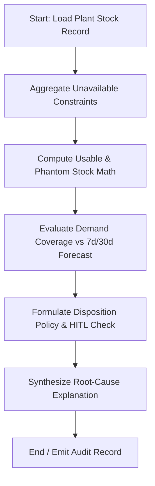

# Agent 2: Phantom Inventory Intelligence Agent

## 1. Executive Summary & Problem Statement
In enterprise SAP environments, physical stock balances recorded in `MARD`/`MSKA`/`MCHB` frequently mislead MRP planners and production dispatchers. While inventory appears physically present, it is often operationally unusable because it is:
- Placed on Quality Hold pending inspection lot results (`QALS`/`QA11`).
- Blocked in storage location (`MARD-SPEME`).
- Committed to unreleased or stale reservation orders (`RESB`).
- Misplaced in non-production storage bins or transit staging.
- Past expiration date or critical minimum remaining shelf life (`MCHB-VFDAT`).

This disparity creates **Phantom Inventory**—ghost availability that leads to line starvation, missed order fulfillment, and unnecessary emergency re-procurement.

**Agent 2: Phantom Inventory Intelligence Agent** continuously audits inventory balances across storage locations, performs deterministic usable stock arithmetic, identifies primary discrepancy root causes, and routes disposition proposals to plant logistics and QA managers via Human-In-The-Loop (HITL).

---

## 2. Architecture & State Machine

Built using **LangGraph** (`StateGraph`), the agent isolates deterministic usability math from LLM explanation synthesis:



### State Definitions
- `stock_id`: Primary stock record identifier.
- `material_id`, `plant_id`, `storage_location`: SAP plant and storage location coordinates.
- `physical_stock`: Total physical stock in location (`MARD-LABST + SPEME + INSME`).
- `reconciliation`: Usable stock, phantom stock, phantom ratio, and primary discrepancy driver.
- `demand_coverage`: 7-day and 30-day requirement coverage ratios.
- `disposition`: Recommended action (`RELEASE_OR_RESOLVE_STATUS`, `ESCALATE_TO_QUALITY`, `VALIDATE_RESERVATION`, `RELOCATE`, `REVIEW_DISPOSITION`).

---

## 3. Mathematical & Policy Foundation

### 3.1 Usable Stock Deterministic Formula
$$\text{Total Unavailable} = \text{Blocked} + \text{QualityHold} + \text{Reserved} + \text{WrongLocation} + \text{Expired}$$
$$\text{Usable Stock} = \max(0, \text{Physical Stock} - \text{Total Unavailable})$$
$$\text{Phantom Stock} = \text{Physical Stock} - \text{Usable Stock}$$
$$\text{Phantom Ratio} = \frac{\text{Phantom Stock}}{\text{Physical Stock}}$$

### 3.2 Phantom Risk Bands
- **HIGH**: $\text{Phantom Ratio} \ge 0.50$ (More than 50% of stock is unusable)
- **MEDIUM**: $0.20 \le \text{Phantom Ratio} < 0.50$
- **LOW**: $0.0 < \text{Phantom Ratio} < 0.20$
- **NONE**: $\text{Phantom Ratio} = 0.0$

### 3.3 Disposition Matrix

| Primary Driver | SAP Tables Involved | Recommended Action | HITL Routing |
| :--- | :--- | :--- | :--- |
| `STATUS_BLOCKED` | `MARD` (SPEME) | `RELEASE_OR_RESOLVE_STATUS` | Plant Warehouse Supervisor |
| `QUALITY_HOLD` | `QALS`, `QAVE` | `ESCALATE_TO_QUALITY` | Quality Management (QA11) |
| `RESERVED_COMMITMENT` | `RESB`, `AFKO` | `VALIDATE_RESERVATION` | Production Planner |
| `WRONG_LOCATION` | `LAGP`, `LTAP` | `RELOCATE` | Internal Logistics / Forklift Lead |
| `EXPIRED_SHELF_LIFE` | `MCHB` (VFDAT) | `REVIEW_DISPOSITION` | Scrap / Rework Committee |

---

## 4. Local Synthetic Datasets

Located in `Phantom_Inventory_Agent_Synthetic_Data/`:
- `inventory_stock.csv`: Base inventory records across plants and storage locations.
- `reservations.csv`: Active and stale production/sales reservation lines (`RESB`).
- `quality_holds.csv`: Inspection lot data (`QALS`).
- `batch_shelf_life.csv`: Expiration dates and batch shelf-life metrics (`MCHB`).
- `demand_requirements.csv`: Immediate 7-day and 30-day gross requirements.
- `demo_cases.csv`: 16 curated test scenarios covering all planted conditions.

---

## 5. Standalone POC Runner

To run the standalone proof-of-concept for Agent 2:

```powershell
# From workspace root
.\.venv\Scripts\python.exe "Agent 2/run_agent.py"
```

Or from within the `Agent 2` folder:
```powershell
cd "Agent 2"
..\.venv\Scripts\python.exe run_agent.py
```

---

## 6. Enterprise Integration Points (TO-BE SAP S/4HANA)
- **BAPI_GOODSMVT_CREATE**: Movement type 343 (unblock stock), 311 (storage location transfer), or 551 (scrap write-off).
- **BAPI_INSPOPER_RECORDUSAGEDEC**: Quality usage decision triggering status release.
- **BAPI_RESERVATION_CHANGE**: De-allocation of stale reservation quantities.
