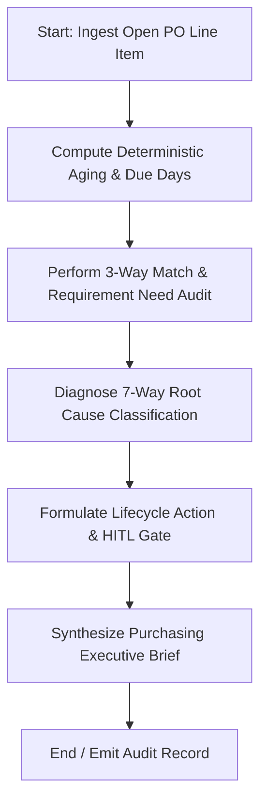

# Agent 4: PO Aging Intelligence & Demand Validation Agent

## 1. Executive Summary & Problem Statement
Over time, enterprise SAP ERP systems accumulate thousands of open purchase order line items (`EKPO`/`EKET`). These aged commitments tie up working capital on balance sheets, artificially consume supplier capacity, distort MRP gross-to-net calculations (`MD04`), and generate friction across Accounts Payable (`RBNI` - Goods Received / Not Invoiced).

Traditional cleanup involves blunt date cutoffs (e.g. "cancel everything older than 90 days"), which inadvertently cancels critical long-lead items or components tied to upcoming production runs.

**Agent 4: PO Aging Intelligence Agent** audits aged purchase orders, cross-references demand need states (`MD04`/`RESB`), 3-way invoice matching variances (`RBKP`/`RSEG`), release blocks (`EKKO-FRGKE`), and supplier rescheduling churn, categorizing root causes across 7 archetypes and executing targeted lifecycle actions.

---

## 2. Architecture & State Machine

Built with **LangGraph** (`StateGraph`), the agent isolates deterministic aging mathematics from narrative explanation:



### State Definitions
- `po_number`, `material_id`, `supplier_id`, `plant_id`: Core purchasing coordinates.
- `aging_metrics`: Ordered quantity, received quantity, residual quantity, remaining open commitment value (INR), aging days (from PO creation), due days (from promised delivery date).
- `diagnosis`: Root cause archetype, recommended action, rationale, priority.
- `hitl_status`: `PENDING_APPROVAL` for destructive or financial actions (`CLOSE_PO`, `CANCEL`, `SUPPLIER_REVIEW`); `AUTO_RESOLVED` for valid open items (`KEEP_OPEN`).

---

## 3. Mathematical & Policy Foundation

### 3.1 Deterministic Aging & Open Commitment Math
$$\text{Remaining Qty} = \max(0, \text{Ordered Qty} - \text{Received Qty})$$
$$\text{PO Value Remaining} = \text{Remaining Qty} \times \text{Net Unit Price}$$
$$\text{Aging Days} = \text{Snapshot Date} - \text{PO Creation Date}$$
$$\text{Due Days} = \text{Snapshot Date} - \text{Requested Delivery Date}$$

### 3.2 Root-Cause Diagnostic Hierarchy

```
1. Is Remaining Qty == 0? ──► YES ──► FULLY_RECEIVED ──────────► Action: CLOSE_PO
        │ NO
2. Is Release Status Blocked? ─► YES ─► PO_BLOCKED ─────────────► Action: RELEASE_OR_BLOCK_RESOLUTION
        │ NO
3. Is Invoice Variance > 0? ──► YES ──► INVOICE_MISMATCH ───────► Action: FINANCE_AP_REVIEW
        │ NO
4. Is Need State Cancelled? ──► YES ──► REQUIREMENT_CANCELLED ──► Action: CLOSE_OR_CANCEL_WORKFLOW
        │ NO
5. Is Need State Closed? ─────► YES ──► REQUIREMENT_CLOSED ─────► Action: CLOSE_OR_CANCEL_WORKFLOW
        │ NO
6. Reschedule Churn >= 2? ────► YES ──► REPEATED_RESCHEDULE ────► Action: SUPPLIER_REVIEW
        │ NO
7. Residual with Valid Demand? ─► YES ─► VALID_FUTURE_DEMAND ────► Action: KEEP_OPEN
```

---

## 4. Local Synthetic Datasets

Located in `PO_Aging_Intelligence_Agent_Synthetic_Data/`:
- `current_open_purchase_orders.csv`: Open PO lines with quantities, pricing, and dates.
- `requirements.csv`: Underlying production orders, sales orders, and forecasts (`MD04`).
- `goods_receipts.csv`: Goods receipt postings (`EKBE`/`MSEG`).
- `invoice_status.csv`: AP matching records (`RSEG`/`RBKP`).
- `po_release_status.csv`: Purchasing release strategy blocks (`EKKO`).
- `po_change_history.csv`: Audit log of delivery date pushes and amendments (`CDHDR`/`CDPOS`).
- `demo_cases.csv`: 12 curated test cases representing each archetype.

---

## 5. Standalone POC Runner

To run the standalone proof-of-concept for Agent 4:

```powershell
# From workspace root
.\.venv\Scripts\python.exe "Agent 4/run_agent.py"
```

Or from within the `Agent 4` folder:
```powershell
cd "Agent 4"
..\.venv\Scripts\python.exe run_agent.py
```

---

## 6. Enterprise Integration Points (TO-BE SAP S/4HANA)
- **BAPI_PO_CHANGE**: Set delivery completed indicator (`EKPO-ELIKZ`) or deletion flag (`EKPO-LOEKZ`).
- **BAPI_PO_RELEASE**: Release blocked purchase orders after compliance verification.
- **MRBR / MIRO**: Release Accounts Payable invoice payment blocks.
