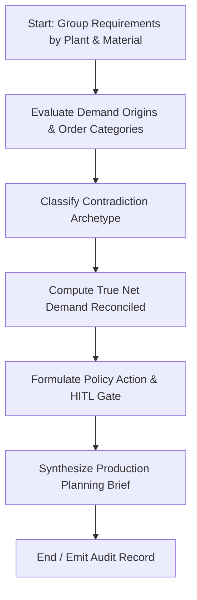

# Agent 5: Requirement Contradiction Intelligence Agent

## 1. Executive Summary & Problem Statement
In manufacturing facilities operating SAP PP/DS and S/4HANA Demand Management, MRP runs (`MD01N`) frequently digest conflicting signals across the Stock/Requirements list (`MD04`). Schedulers routinely confront duplicate requisitions generated by overlapping planning runs, unconsumed Planned Independent Requirements (PIR / Forecast) colliding with newly confirmed customer sales orders, and cancelled production orders whose dependent reservations (`RESB`) erroneously remain active.

When planners cannot immediately disambiguate genuine competing demand from phantom double-counting, they either order excess stock (bloating inventory carrying costs) or delay ordering (causing stockouts).

**Agent 5: Requirement Contradiction Intelligence Agent** audits requirement clusters, distinguishes true competing demand from 4 archetypes of demand noise, and recommends surgical reconciliation actions under Human-In-The-Loop (HITL) supervision.

---

## 2. Architecture & State Machine

Built using **LangGraph** (`StateGraph`), the agent decouples demand reconciliation rules from natural language explanations:



### State Definitions
- `plant_id`, `material_id`: Target manufacturing coordinates.
- `requirement_ids`: Pipe-delimited list of clustered demand tokens.
- `contradiction_type`: Archetype classification (`DUPLICATE_OVERLAP`, `VALID_COMPETING_DEMAND`, `FIRM_FORECAST_COLLISION`, `CANCELLED_REQUIREMENT_CONFLICT`, `DOUBLE_COUNTING_RISK`).
- `recommended_action`: Operational directive (`REVIEW_DEDUPLICATION`, `KEEP_BOTH`, `REVIEW_DEMAND_PRIORITY`, `REMOVE_CANCELLED_DEMAND`, `RECONCILE_REQUIREMENT_LINK`).
- `hitl_status`: `PENDING_APPROVAL` for disruptive changes; `AUTO_RESOLVED` for legitimate competing demand.

---

## 3. Mathematical & Policy Foundation

### 3.1 Net Demand Equation
$$\text{Clean Net Demand} = \sum_{r \in \text{Valid Requirements}} \text{Qty}_r - \sum_{s \in \text{Allocated Supply}} \text{Qty}_s$$

### 3.2 Contradiction Archetype Matrix

| Archetype | SAP Planning Phenomenon | Recommended Action |
| :--- | :--- | :--- |
| `DUPLICATE_OVERLAP` | Multiple MRP runs generated duplicate planned orders for the identical date. | `REVIEW_DEDUPLICATION` |
| `VALID_COMPETING_DEMAND` | Two distinct sales orders or production lines genuinely competing for the same part. | `KEEP_BOTH` (Autonomous) |
| `FIRM_FORECAST_COLLISION` | Unconsumed PIR forecast overlaps newly arrived firm sales order. | `REVIEW_DEMAND_PRIORITY` |
| `CANCELLED_REQUIREMENT_CONFLICT` | Production order marked TECO/CLSD but dependent reservation remains unflagged. | `REMOVE_CANCELLED_DEMAND` |
| `DOUBLE_COUNTING_RISK` | Top-level sales order and sub-assembly MRP order both booked direct demand. | `RECONCILE_REQUIREMENT_LINK` |

---

## 4. Local Synthetic Datasets

Located in `Requirement_Contradiction_Agent_Synthetic_Data/`:
- `requirements.csv`: Demand requirements across production orders, sales orders, forecasts, and maintenance.
- `reservations.csv`: Dependent component reservations (`RESB`).
- `supply_context.csv`: Open purchase orders and production receipts.
- `materials.csv` & `material_plant_master.csv`: Master data attributes.
- `demo_cases.csv`: 6 curated test cases representing each contradiction archetype.
- `contradiction_ground_truth.csv`: Official expected classifications.

---

## 5. Standalone POC Runner

To run the standalone proof-of-concept for Agent 5:

```powershell
# From workspace root
.\.venv\Scripts\python.exe "Agent 5/run_agent.py"
```

Or from within the `Agent 5` folder:
```powershell
cd "Agent 5"
..\.venv\Scripts\python.exe run_agent.py
```

---

## 6. Enterprise Integration Points (TO-BE SAP S/4HANA)
- **BAPI_REQUIREMENTS_CHANGE**: Consume or reduce PIR forecast quantities.
- **BAPI_RESERVATION_DELETE**: Purge obsolete reservation lines.
- **BAPI_PLANNEDORDER_DELETE**: Eliminate duplicate MRP planned orders.
