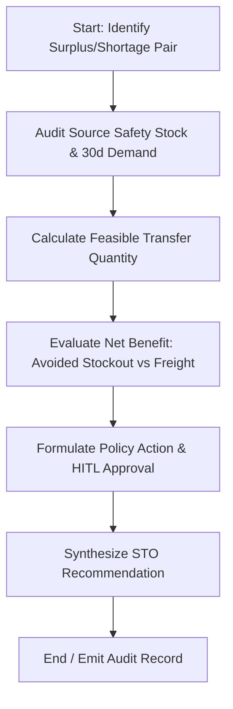

# Agent 3: Material Twin-Location Balancing Agent

## 1. Executive Summary & Problem Statement
Large multi-facility manufacturing enterprises running SAP often experience "twin-location imbalance": Plant A suffers from a critical stockout of a raw material or component threatening line starvation, while Plant B maintains a massive surplus of the identical material. 

Standard SAP MRP (`MD01N`) runs independently per plant or within predefined MRP areas, leaving cross-plant rebalancing to manual phone calls, disconnected spreadsheets, and informal buyer negotiations. Furthermore, uncoordinated inter-plant stock transfers can inadvertently starve the supplying plant of safety stock or incur freight costs that exceed the value of the line delay.

**Agent 3: Material Twin-Location Balancing Agent** continuously monitors multi-plant inventory levels (`MARC`/`MARD`), strictly protects source plant safety stock and 30-day forward demand, computes lane-level logistics economics, and issues Stock Transport Order (STO) recommendations with quantified ROI.

---

## 2. Architecture & State Machine

Built using **LangGraph** (`StateGraph`), the agent isolates deterministic logistics arithmetic from natural language synthesis:



### State Definitions
- `transfer_option_id`: Unique STO proposal identifier.
- `material_id`: Material number (`MARA-MATNR`).
- `source_plant` & `destination_plant`: Supplying and receiving plants (`T001W`).
- `source_protection`: Source plant on-hand, 30-day demand, and safety stock shield.
- `economics`: Feasible transfer quantity, inventory value moved, freight cost, avoided stockout cost, and net benefit.
- `hitl_status`: PENDING_APPROVAL for positive ROI transfers.

---

## 3. Mathematical & Policy Foundation

### 3.1 Source Plant Protection Math
$$\text{Protected Stock} = \text{Source 30-Day Demand} + \text{Source Safety Stock}$$
$$\text{Available Source Surplus} = \max(0, \text{Source On Hand} - \text{Protected Stock})$$

> [!IMPORTANT]
> A transfer is strictly forbidden if $\text{Available Source Surplus} \le 0$, preventing the agent from robbing Peter to pay Paul.

### 3.2 Transfer Economics & Feasibility
$$\text{Feasible Qty} = \min(\text{Candidate Qty}, \text{Available Source Surplus})$$
$$\text{Inventory Value Moved} = \text{Feasible Qty} \times \text{Material Unit Value}$$
$$\text{Net Economic Benefit} = \text{Avoided Destination Stockout Cost} - \text{Estimated Freight Cost}$$

### 3.3 Decision Policy Matrix

| Condition | Policy Outcome | Action Taken |
| :--- | :--- | :--- |
| $\text{Surplus} \le 0$ | `REJECT_PROTECT_SOURCE_STOCK` | Transfer blocked to protect supplying plant. |
| $\text{Net Benefit} \le 0$ | `REJECT_UNFAVORABLE_ECONOMICS` | Transfer blocked: freight exceeds delay cost. |
| $\text{Net Benefit} > 0$ and $\text{Feasible Qty} > 0$ | `TRANSFER_RECOMMENDED` | Routed to Central Logistics Queue (HITL). |

---

## 4. Local Synthetic Datasets

Located in `Material_Twin_Location_Agent_Synthetic_Data/`:
- `materials.csv`: Master data with criticality ratings, UoM, and unit costs.
- `plants.csv`: Plant locations and operating regions.
- `plant_material_stock.csv`: Local stock balances across plants.
- `plant_material_demand.csv`: 30-day and 90-day gross requirements.
- `plant_lanes.csv`: Inter-plant transit times (days) and freight rate matrices.
- `candidate_transfer_options.csv`: Unreconciled candidate transfer opportunities.
- `demo_cases.csv`: 10 curated test cases representing distinct operational scenarios.
- `transfer_decision_ground_truth.csv`: Benchmark decision criteria.

---

## 5. Standalone POC Runner

To run the standalone proof-of-concept for Agent 3:

```powershell
# From workspace root
.\.venv\Scripts\python.exe "Agent3/run_agent.py"
```

Or from within the `Agent3` folder:
```powershell
cd "Agent3"
..\.venv\Scripts\python.exe run_agent.py
```

---

## 6. Enterprise Integration Points (TO-BE SAP S/4HANA)
- **BAPI_PO_CREATE1**: Creation of Stock Transport Order (STO document type `UB`).
- **BAPI_OUTB_DELIVERY_CREATE_STO**: Generation of outbound replenishment delivery (`NL`).
- **Movement Type 351 / 101**: Goods issue to two-step transit stock and subsequent receipt.
