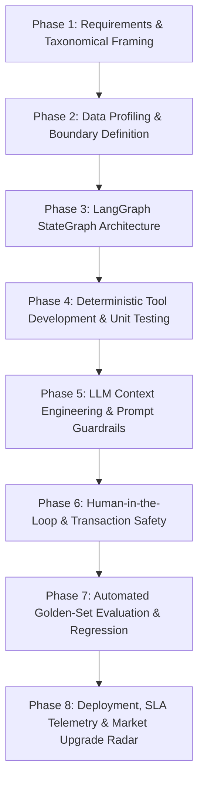

# ENTERPRISE SDLC PLAN & GOVERNANCE
## Bcone SAP Supply Chain Agentic AI Platform

**Version:** 1.2.0  
**Status:** Approved Engineering Standard  
**Governing Roles:** CTO, CFO, Principal AI Architect, Engineering Manager, QA Lead  

---

## 1. Overview & Core Philosophy

Developing agentic AI systems for enterprise ERP systems (like SAP S/4HANA) demands a rigorous Software Development Life Cycle (SDLC) far beyond traditional web applications. Because autonomous agents can propose or trigger consequential business actions (e.g. canceling purchase orders, altering planned delivery dates, or initiating inter-plant transfers), strict governance, verification gates, and deterministic safeguards are mandatory.

---

## 2. The 8-Phase Agentic SDLC Framework

### Phase 1: Requirements & Taxonomical Framing
- All system requirements are classified under strict tags:
  - `BLOCKER`: Requires immediate user intervention before coding.
  - `REQUIRES USER DECISION`: Architectural preference with safe default assumption.
  - `REQUIRES SAP VALIDATION`: Specific S/4HANA CDS view, BAPI, or table mapping dependent on live landscape release.
  - `ASSUMPTION`: Operational or mathematical rule formulated by engineering to proceed autonomously.
  - `OPTIONAL ENHANCEMENT`: Post-POC enterprise enhancements.

### Phase 2: Data Profiling & Boundary Definition
- Ingestion of transactional and master data (CSV synthetic sets).
- Strict identification of **Deterministic Boundaries** vs **Probabilistic (LLM) Boundaries**:
  - *Deterministic*: Stock subtraction, delay averages, distance freight calculations, net demand sums.
  - *Probabilistic*: Cross-file narrative synthesis, qualitative root-cause reasoning, human-readable explanations.

### Phase 3: LangGraph StateGraph Architecture
- Design of explicit cyclic state machines using LangGraph `StateGraph`.
- Definition of `AgentState` schema ensuring complete state traceability.
- Mapping entry points, computation nodes, policy gates, and conditional branch routes.

### Phase 4: Deterministic Tool Development & Unit Testing
- Authoring pure Python mathematical modules in `src/tools/`.
- 100% test coverage via `pytest` for all formulas (usable stock equation, source safety stock protection, freight vs stockout net benefit, aging days, net demand).

### Phase 5: LLM Context Engineering & Prompt Guardrails
- Configuration of local Ollama models (`gemma4:latest` primary, `llama3.2:latest` fallback).
- Structured prompt engineering passing only sanitized, pre-calculated metrics.
- Prevention of hallucinations through deterministic fallback synthesis.

### Phase 6: Human-in-the-Loop & Transaction Safety
- Enforcement of `ENABLE_WRITE_ACTIONS=false` default.
- Implementation of `ApprovalManager` holding consequential actions in `PENDING` status.
- Integration of `SimulationActionExecutor` providing before/after state diffs.
- Structured append-only audit logging in JSONL format.

### Phase 7: Automated Golden-Set Evaluation & Regression
- Verification against curated demo cases and ground-truth benchmark datasets.
- Pass criteria: 100% alignment on action recommendations and zero unhandled exceptions.

### Phase 8: Deployment, SLA Telemetry & Market Upgrade Radar
- Native enterprise production deployment via Windows Services (NSSM/Task Scheduler), Linux Systemd, or PM2 process managers.
- Continuous monitoring via `PerformanceReporter` tracking latency, SLA, and economic value.
- Quarterly technology reviews via `TechnologyRadarAdvisory` benchmarking emerging models (Qwen 2.5, DeepSeek-R1) and runtimes (vLLM).

---

## 3. Review Gates & Quality Checklists

| Gate | Reviewer | Mandatory Artifact / Check |
| :--- | :--- | :--- |
| **Gate 1: Architecture Review** | CTO & AI Architect | LangGraph StateGraph topology, deterministic/LLM boundary check |
| **Gate 2: SAP Domain Review** | SAP Supply Chain SME | Business process alignment, CDS view mapping, movement type safety |
| **Gate 3: Financial & ROI Review** | CFO | Stockout cost avoidance formula, freight net benefit economics |
| **Gate 4: Code & Security Review** | Engineering Manager | Virtual environment isolation, `.env` hygiene, read-only system of record guard |
| **Gate 5: QA & Evaluation Review** | QA Lead | 100% pytest pass on deterministic tools and golden test scenarios |
